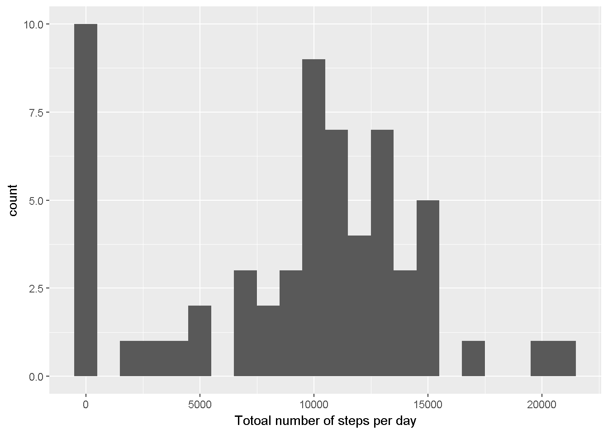
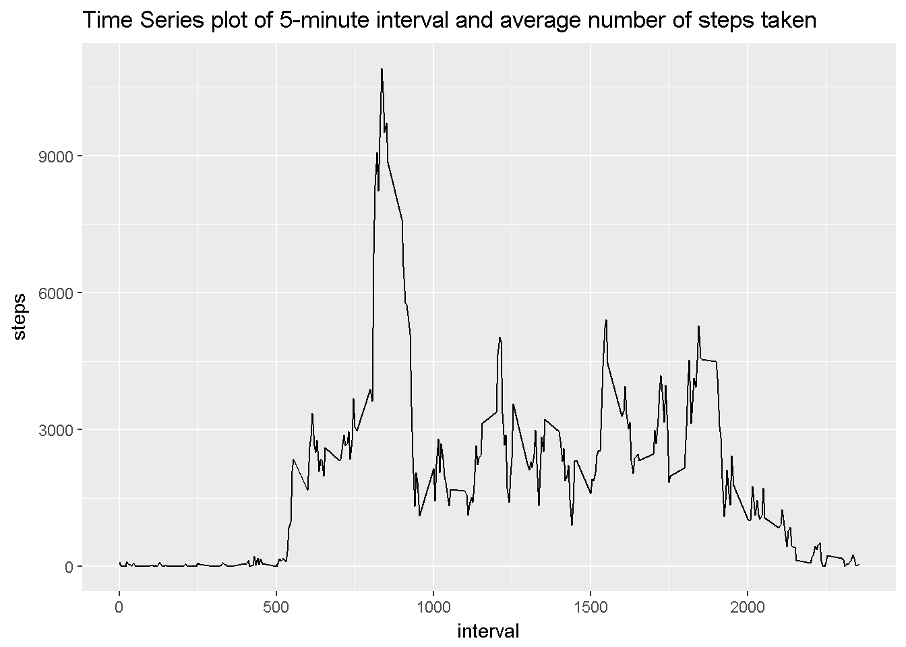
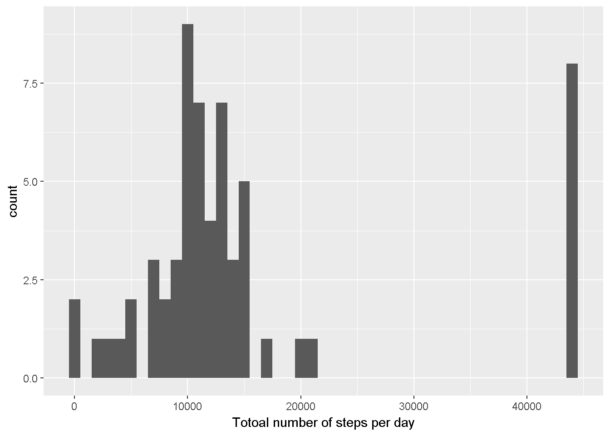
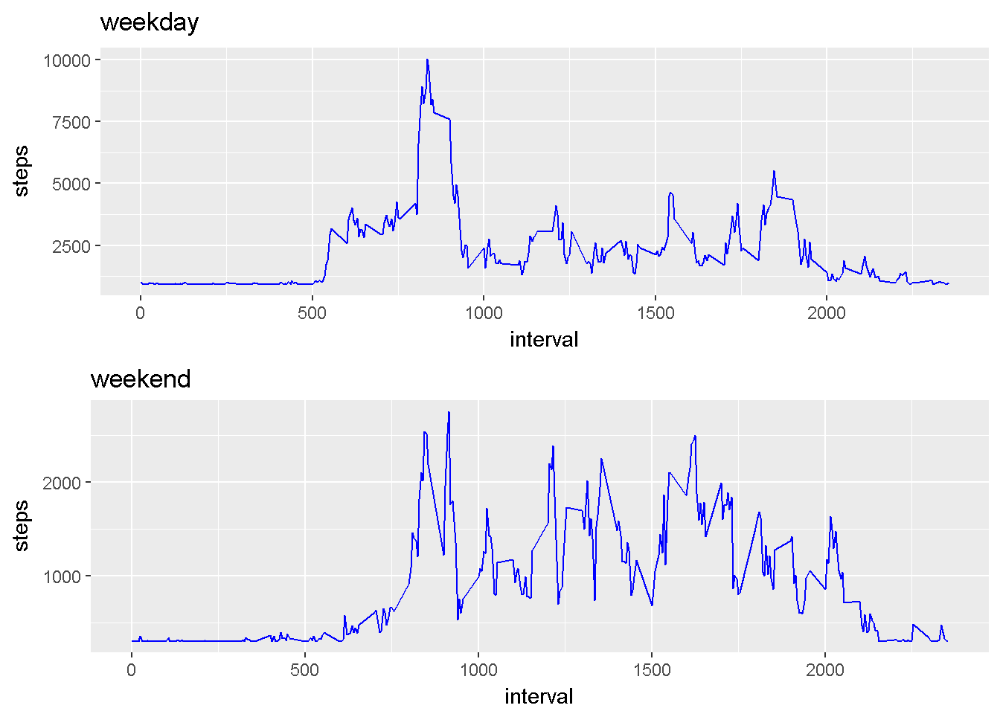

## Loading and Processing Data (activity.csv)

The dataset is pretty neat and doesn't require any sophisticated processing for now.


```r
d <- read.csv("activity.csv")
```

## What is mean total number of steps taken per day?

#### Getting total number of steps per day. 


```r
library(ggplot2)
st <- tapply(d$steps, d$date, FUN = sum, na.rm = TRUE)
```
#### Generating the histogram. 


```r
 qplot(st, binwidth = 1000, xlab = "Totoal number of steps per day")
```



#### Reporting the mean and median.
Mean: 

```r
  mean(st)
```

```
## [1] 9354.23
```
Median: 

```r
  median(st)
```

```
## [1] 10395
```
## What is the average daily activity pattern? 

#### Extracting the data 

```r
st2 <- aggregate(d$steps, by = list(d$interval), FUN = sum, na.rm = T)
 names(st2)[1] = "interval"
 names(st2)[2] = "steps"
```
#### Generating the plot.

```r
ggplot(st2, aes(interval, steps))+geom_line()+ggtitle("Time Series plot of 5-minute interval and average number of steps taken")
```




#### Which 5-minute interval, on average across all the days in the dataset, contains the maximum number of steps?


```r
filter(st2, st2$steps == max(st2$steps))[1]
```

```
##   interval
## 1      835
```

## Imputing missing values

My method of imputing missing values is pretty **simple** and **naive**. I am putting average number of steps over the entire dataset into missing values i.e.  **NAs**.

#### Replicating old dataset 

```r
d2 <- d
```
#### Imputing missing values.  

```r
d2 <- transform(d2, steps = ifelse(is.na(steps), mean(st)/length(st), steps))
```

#### Histogram with imputed missing values. 

```r
stx <- tapply(d2$steps, d2$date, FUN = sum, na.rm = TRUE)
qplot(stx, binwidth = 1000, xlab = "Totoal number of steps per day")
```




#### Effect on mean and Median. 
Mean: 

```r
mean(stx)
```

```
## [1] 15146.26
```
Median:

```r
median(stx)
```

```
## [1] 11458
```

As we can clearly see the difference, the previous values of mean, meadian and plot are **significantly** different from the new results. 

## Are there differences in activity patterns between weekdays and weekends?

#### Creating a new factor segregating days based on weekend and weekdays.

```r
library(dplyr)
d3 <- d2

d3 <- mutate(d3, day = ifelse(weekdays(as.Date(date)) %in% c("Monday","Tuesday","Wednesday","Thursday","Friday"), "weekday","weekend"))

weekdaydata <- filter(d3, day == "weekday")
weekenddata <- filter(d3, day == "weekend")

weekdaydata <- aggregate(weekdaydata$steps, by = list(weekdaydata$interval), sum)
names(weekdaydata)[2] <- "steps"
names(weekdaydata)[1] <- "interval"

weekenddata <- aggregate(weekenddata$steps, by = list(weekenddata$interval), sum)
names(weekenddata)[1] <- "interval"
names(weekenddata)[2] <- "steps"
require(gridExtra)
p1 <- ggplot(weekdaydata, aes(interval, steps))+geom_line(color = "blue")+ggtitle("weekday")
p2 <- ggplot(weekenddata, aes(interval, steps))+geom_line(color = "blue")+ggtitle("weekend")
grid.arrange(p1, p2, nrow=2)
```




As we can see the weekend and weekdays steps pattern are significantly different. 
